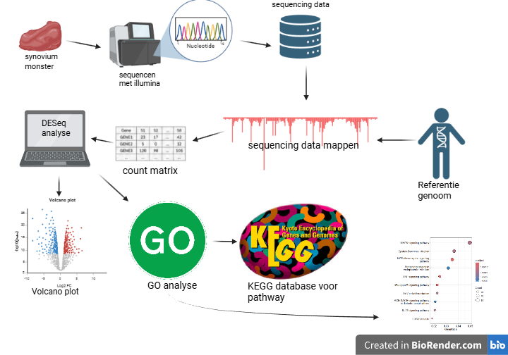
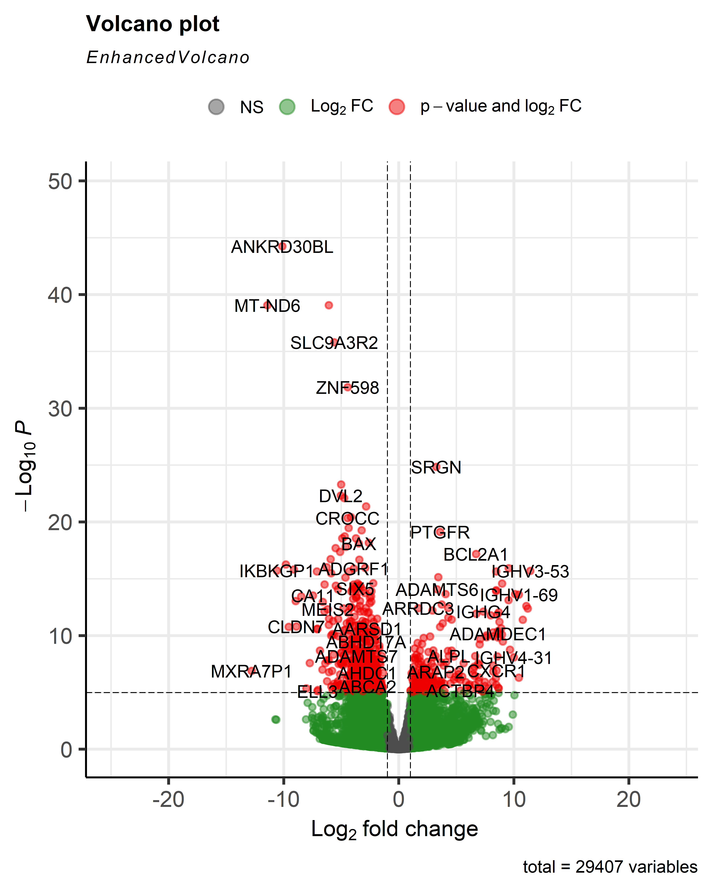

# NOD-like receptors zijn betrokken bij reumatoïde artritis

## 📁 Inhoud/structuur

- `Ruwe data` –Dit is de map met alle Ruwe data behalve het menselijk genoom (die staat in bronnen)
- `Verwerkte data` - Hierin staat alle verwerkte data
- `Code` – Hier staat de code geschreven in R
- `Bronnen` - deze map is voor de gebruikte bronnen 
- `Figuren` - Alle gemaakte figuren staan hierin
- `Databeheer` - hierin staat hoe de github pagina in elkaar zit en waarom
---

## Introductie

Reumatoide artritis, ook bekend als reuma, is een auto-imuunziekte. Mensen die last hebben van reuma krijgen ontstekingen in de gewrichten. Op dit moment is er nog geen medicijn om reuma volledig te genezen, maar het kan wel geremd worden. [(UMC Utrecht, n.d.)](Bronnen/UMC_Utrecht_reumatoide_artritis.url) In 2024 waren er in nederland bij schatting van het RIVM 282.800 mensen met reuma Reuma komt vaker voor bij vrouwen dan bij mannen, en bij ouderen komt de ziekte vaker voor. [(RIVM, n.d.)]( https://www.vzinfo.nl/reumatoide-artritis-ra/leeftijd-en-geslacht)

Om er achter te komen of iemand reuma heeft kan je kijken naar ACPA (Anti-Citrullinated Protein Antibodies). ACPA zijn antistoffen tegen het eiwit CCP die in het bloed gevonden kunnen worden bij mensen met reumatoïde artritis. Wanneer iemand een positieve ACPA-test heeft in combinatie met gewrichtsontstekingen, is de kans groot dat die persoon reuma heeft. [(Reuma Magazine, 2022)](Bronnen/Reuma_Magazine,2022,February_4.url) 

Er is al bekend dat bij reuma genexpressie kan verschillen van een gezond persoon. Er is bijvoorbeeld gevonden dat veel genen die te maken hebben met actine filamenten andere expressie tonen bij vroege reuma. [Platzer et al. (2019)]( https://pmc.ncbi.nlm.nih.gov/articles/PMC6657850/#sec001)

In dit onderzoek wordt de sequencing data van reuma patiënten vergeleken met data van gezonde mensen om te zien welke genen andere expressie tonen, ook wordt er gekeken naar de genetische pathways die betrokken zijn bij reuma.
Voor dit onderzoek zijn de volgende deelvragen opgesteld.
- 	Welke genen komen anders tot expressie in het gewrichtsslijmvlies van patiënten met reuma ten opzichte van gezonde mensen?
- 	Welke genetische pathways zijn betrokken bij reuma?

## Methoden
Voor dit onderzoek zijn RNA-sequencinggegevens gebruikt van vier patiënten met reuma en vier controlepatiënten zonder reuma. De monsters zijn verkregen uit gewrichtsslijmvlies door middel van een synoviumbiopt. De patiënten met reuma waren meer dan één jaar vóór afname van het biopt positief getest op ACPA. De gebruikte dataset is afkomstig uit [Platzer et al. (2019)]( https://pmc.ncbi.nlm.nih.gov/articles/PMC6657850/#sec001) en de sequencing is uitgevoerd met een Illumina-sequencer.

De transcriptomicsanalyse is uitgevoerd in R. Het menselijke referentiegenoom [(zie hier)](Bronnen/menselijk_genoom.url) is geïndexeerd met de package Rsubread (versie 2.24.0; Liao et al. (2019)). Vervolgens zijn alle monsters gemapt tegen het referentiegenoom, waarbij per monster een BAM-bestand is gegenereerd [.BAM_bestanden](Verwerkte_data/.BAM_bestanden). Het aantal reads per gen is bepaald en samengevoegd in een countmatrix. Differentiale genexpressie is geanalyseerd met DESeq2 (versie 1.50.2; Love et al. (2014)). Genen met een aangepaste p-waarde < 0,05 zijn als significant beschouwd.

De significante genen zijn gebruikt voor een Gene Ontology (GO)-analyse om biologische processen te identificeren die verschillen tussen beide groepen. Daarnaast is met KEGG onderzocht welke pathways verrijkt waren. Het volledige R-script met de gebruikte analyse is opgenomen in het mapje [Code], zodat de analyse reproduceerbaar is en de methode is ook te zien in [figuur 1](verwijs naar flowschema + zet in tekst misschien).

  
  
  <em>Figuur 1: Flowchart van de uitgevoerde methode</em>

## 📊 Resultaten
DESeq analyse:
Er is een deseq analyse uitgevoerd op de sequencing data van de synovium monsters, hieruit is een volcanoplot gekomen. 
Enkele genen, zoals ANKRD30BL, MT-ND6 en SRGN, vallen sterk op in de [volcanoplot (figuur 2)](figuren/VolcanoplotWC.png), omdat deze een groot verschil laten zien tussen de groepen en ook erg significant zijn. Dit kan betekenen dat deze genen mogelijk betrokken zijn bij processen die een rol spelen bij reumatoïde artritis.

  
  
  <em>Figuur 2: Volcanoplot</em>

GO analyse:
Uit de GO analyse vallen vooral de MAPK signaling pathway, Epstein-Barr virus infection en NOD like receptor signaling pathway op. Deze drie staan het hoogst in de [dotplot (figuur 3)](figuren/dotplotGO.png) wat betekend dat ze de hoogst gene ratio’s hebben. De MAPK signaling pathway heeft de hoogste gene ratio maar is minder significant dan de NOD like receptor signaling pathway. (figuur 3)

Figuur 3

Pathway analyse:
Uit de pathway analyse van de NOD like receptor signaling pathway [(hsa04621)]( figuren/hsa04621.pathview.png) met de KEGG database is gekomen dat de pro-inflammatory effects bij patiënten met reuma hoger zijn dan normaal. (figuur 4) Ook wordt er een hogere expressie in pro-inflammatory cytokines waargenomen. Deze twee verschillen hebben allebei iets te maken met ontstekingsreacties die ook veel voorkomen bij reuma.

Figuur 4

## Conclusie
In dit onderzoek werd onderzocht welke genen en genetische pathways zijn betrokken bij reumatoïde artritis. Op basis van de uitgevoerde transcriptomics en pathwayanalyses kan worden geconcludeerd dat de genexpressie in het gewrichtsslijmvlies van patiënten met reumatoïde artritis verschilt van die van gezonde controles.

Uit de differentiële genexpressieanalyse bleek dat onder andere ANKRD30BL, MT-ND6 en SRGN significant anders tot expressie komen bij patiënten met reuma. Deze genen kunnen daarom betrokken zijn bij de ziekte of de ontstekingsprocessen die daarbij optreden. Daarnaast liet de GO-analyse zien dat vooral de MAPK signaling pathway, NOD-like receptor signaling pathway en Epstein–Barr virus infection pathway verrijkt zijn. De KEGG-pathwayanalyse van de NOD-like receptor signaling pathway toonde bovendien een verhoogde expressie van genen die betrokken zijn bij pro-inflammatoire effecten en de productie van pro-inflammatoire cytokinen. Dit kan betekenen dat NOD-like receptors een belangrijke rol spelen bij de ontstekingen van reuma.

Hoewel dit onderzoek aanwijzingen geeft voor genen en pathways die betrokken zijn bij reumatoïde artritis, zijn de resultaten gebaseerd op een kleine onderzoeksgroep van vier patiënten en vier gezonde controles. Hierdoor moeten de resultaten voorzichtig worden geïnterpreteerd. Vervolgonderzoek met een grotere steekproef is nodig om de gevonden verschillen te bevestigen en de rol van deze genen en pathways verder te onderzoeken.

